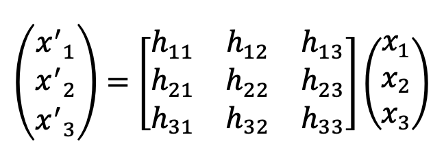
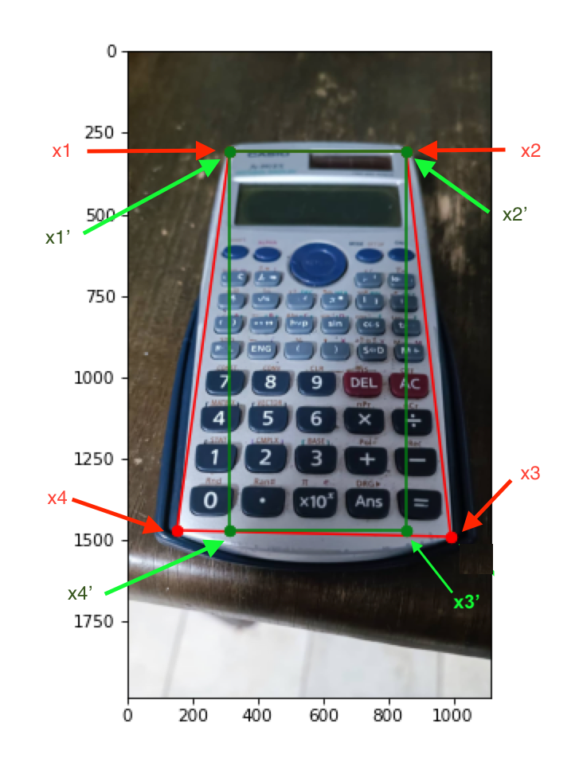
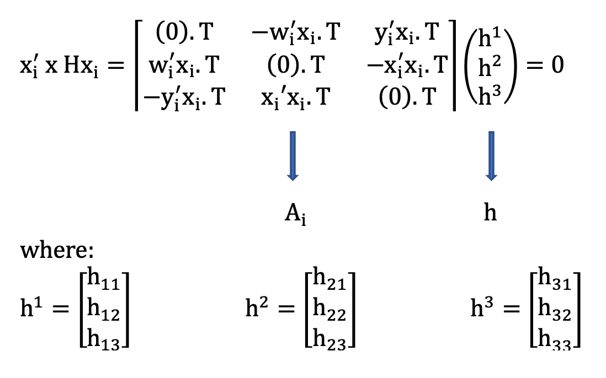
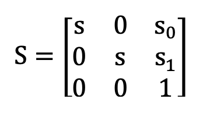
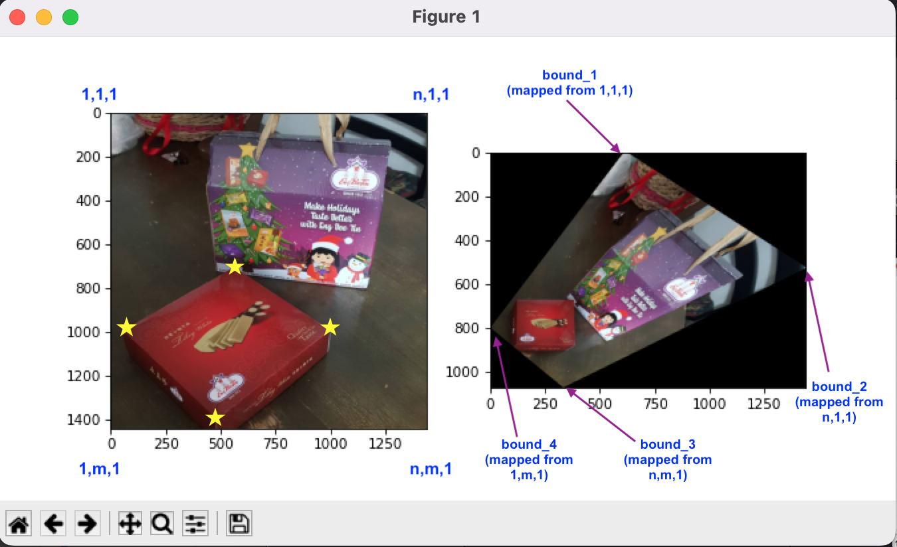
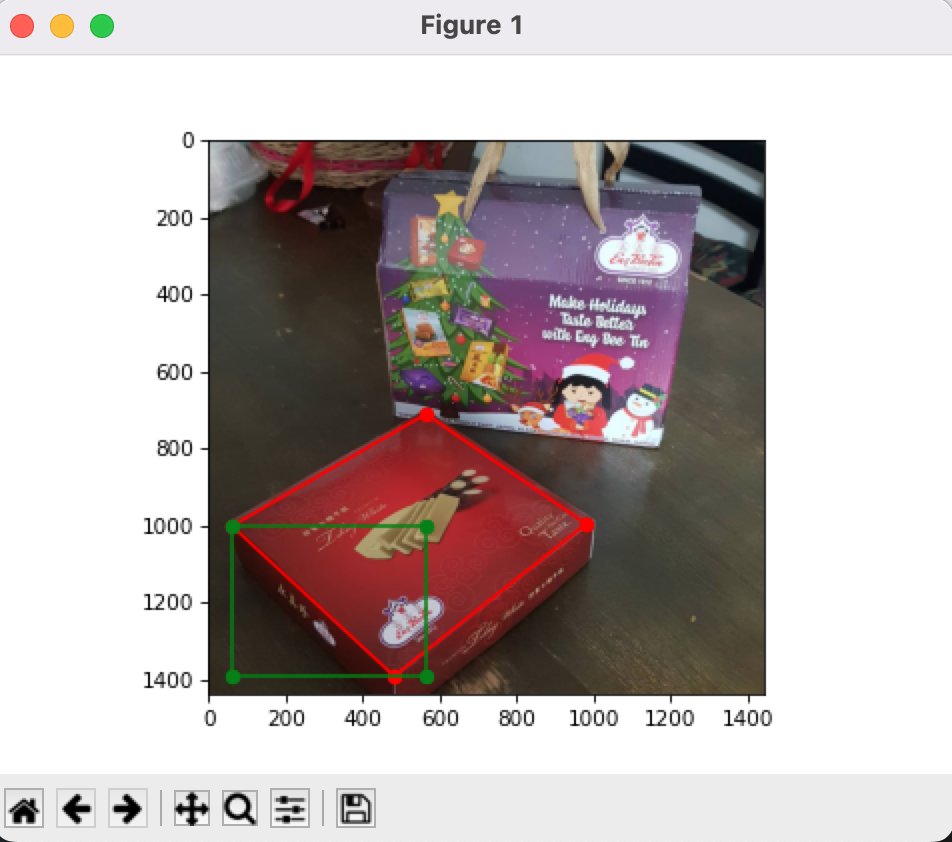
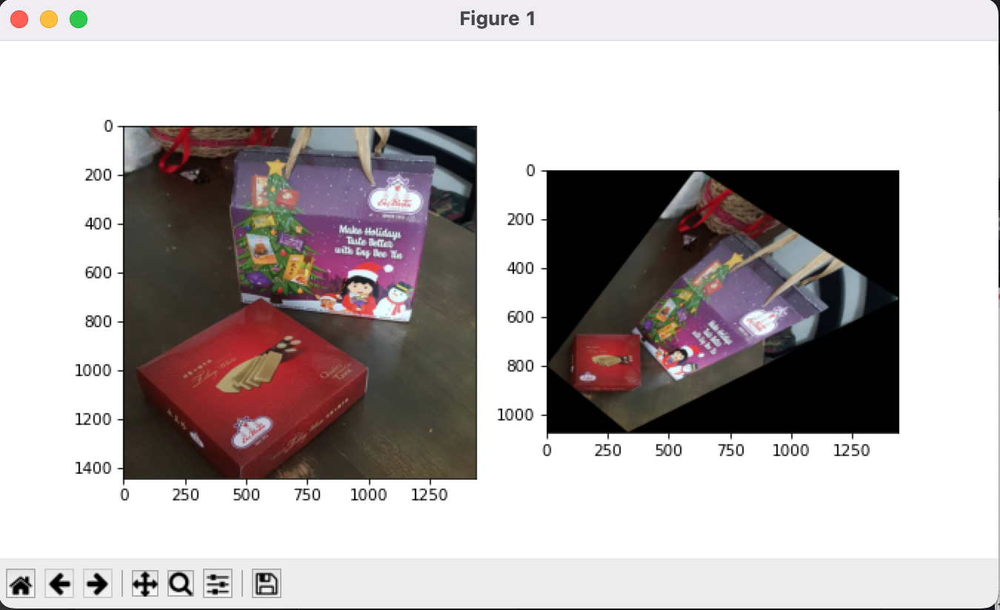

# Machine Problem 1 - Removing Projective Distortion on Images

#### Problem:
When an image is taken by the camera, there is an inherent projective distortion. This makes rectangular objects appear distorted. However, this projective distortion can be reversed if we know the 3x3 matrix that maps from projective to affine (frontal no distortion). 

Using our knowledge on linear mapping and least squares estimation, develop a program that will remove the projective distortion on a given image. Note that at least 4 pts on the target undistorted image must be known.

## Background

#### Projective Transformations

A planar transformation is a linear transformation on homogeneous 3-D vectors represented by a non-singular 3x3 matrix:

The **x_i'** constitutes to the **output (new image with no projective distortion)** while **x_i** represents the **input (original image which is distorted)**. The **homography, H, matrix** is a homogeneous matrix which has 8 DOF. We need to compute homography to facilitate the transformation of x' = Hx to directly map the coordinates as shown:

To obtain the homography H, we apply the **Direct Linear Transformation (DLT) in its normalized form** to all points in the image. Take note that in order to get H, we need to **equate the cross product of x_i' and Hx_i to zero.**

Take note that **x_i = (x_i,y_i,w_i).T and x_i' = (x_i',y_i',w_i').T** The dot T (.T) means that it's transpose

***

Simplifying the equation will give us:

Note that every A_i corresponds to the mapping of x_i and x_i'. Since there will be 4 points to be selected (x1, x2, x3, x4) and there will be 4 corners or bounds on the new image (x1', x2', x3', x4') then we need 4 A_i (A1, A2, A3, A4) stacked in one matrix to map the points and corners (one-to-one correspondence).

To compute H (from h), we need to denote h as a 1-D null space of A

***
After computing for the homography, H, we need to normalize the points and apply DLT to each of the two images. In normalization, we need to translate the coordinates to the center and scale the coordinates so that the average distance of a point x from the centre is sqrt(2).

The scaling matrix is denoted as:

The computed H will also be used to remap the bounds of the original image to the new bounds of the transformed image. To correctly map the bounds, we need to sample the image and multiply it to every value of the H matrix.

The mapping of bounds is shown below:

## How to run my program?

### What you need to know:

1. You may clone the **entire repository** which includes the **python file** (projective_distortion_MSP.py), the **dataset folder** where the sample images are located and the folder where all the images I used in the README.md section are found. Don't forget to view the **README.md** before navigating the files
***
2. I used the **Spyder application** of the Anaconda Navigator in creating the program.
***
3. Open the **Anaconda prompt** (when using Windows/MacOS)to run the program.
***
4. When running the program in the Anaconda prompt, you need to locate the directory where the EE298M-MachineProblem1 repository is located by typing **cd //folder path//** in the Command-Line Interface (CLI). 
**Example: cd /Users/Madee/Desktop/EE298M-MachineProblem1**
***
5. After locating the file, you need to type this in the CLI: **python //filename// //imagenumber//**. Note that image numbers depend on the images in the dataset arranged in alphabetical order (ex: Test1 - 0, Test2 - 1, etc.)
**Example: python projective_distortion_MSP.py 0**
***
6. Choose the four corners of the image that you want to straighten or remove the projective distortion. Please be reminded that **only 4 points** are needed to be selected, otherwise, there will be an error in the program in a form of a spinning wheel
**Note: The selection of the 4 points must be in order (either in CW or in CCW direction)**
***
7. After the red and green boxes appear on the image, **close the figure window** and **wait for another figure window that will appear which shows the original and the corrected image.** This will take about 15-30 seconds.
***
 
### Sample Output:

This is how the figure window looks like **after selecting the corners of the image**:

This is how the figure window looks like **after waiting for about 15-30 seconds**

## References:

 -  EE 298M Lecture Notes by Prof. Rowel Atienza, PhD.

 -  Vision and Perception Course by Fiora Pirri

 -  Restore Image Specular Distortion - Multiple Vision Geometry by CodeAntenna.com
 
 -  Multiple View Geometry in Computer Vision by Richard Hartley, Andrew Zisserman
